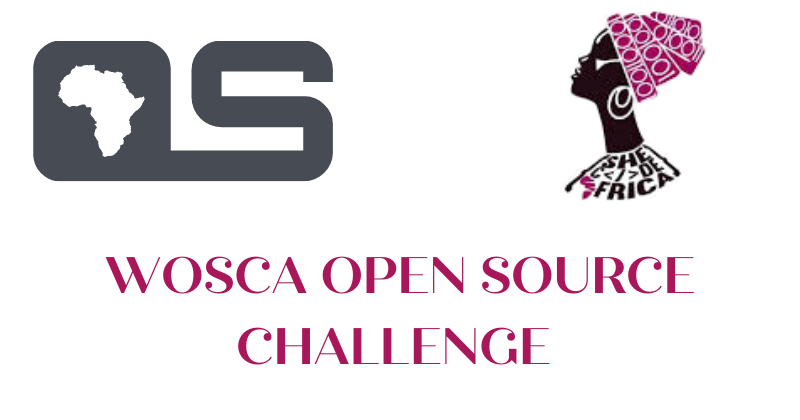

  

| WARNING:  **This event is over**, thanks a lot to all contributors and participants! Cheers!!! |
| --- |

## About the event
Women of OSCA open-source challenge by She Code Africa and Open Source community Africa was held in the month of July 2020. The aim of this initiative was to promote a more      diverse, inclusive and innovative culture within the African open source ecosystem.

To participate in this challenge, ladies were required to register and record all open source contributions/pull requests in the month of July to stand a chance of winning a ***1year domain subscription***.

## Results
We recorded a total of 389 Registrations. [18 participants](#Contributors) submitted 46 pull requests to different open source organizations. We also had ladies among them who recorded their first pull request following the [Submitting your first pull request](https://docs.google.com/presentation/d/1o_WLdAGjm5oyqza8hTSRTzPNAodVFWmNMSli98J488I/edit?usp=sharing) guide. 

## Contributors

<table>
  <tr>
    <td align="center"><a href="https://github.com/Ruth-ikegah"> <b>Ruth Ikegah</b></a> 10 pull requests</td>
    <td align="center"><a href="https://github.com/Adeola-Adesoba/"> <b>Adeola Adesoba</b></a> 6 pull requests</td>
    <td align="center"><a href="https://github.com/PluckyPrecious"> <b>Kelechi Precious Nwachukwu</b></a> 5 pull requests</td>
    <td align="center"><a href="https://github.com/VictoryWekwa"> <b>Wekwa Victory Chiamaka</b></a> 4 pull requests</td>
    <td align="center"><a href="https://github.com/sandygudie"> <b>Goodnews Sunday Sandy</b></a> 3 pull request</td>
  </tr>
  <tr>
    <td align="center"><a href="https://github.com/Code-Ebullient"> <b>Peace Onyekachi</b></a> 3 pull requests</td>
    <td align="center"><a href="https://github.com/ijeomaemeruwa"> <b>Ijeoma Emeruwa</b></a> 2 pull requests</td>
    <td align="center"><a href="https://github.com/jenniekibiri"> <b>Jeniffer Kibiri</b></a> 2 pull requests</td>
    <td align="center"><a href="https://github.com/faithgaiciumia/"> <b>Faith Gaiciumia</b></a> 1 pull request</td>
    <td align="center"><a href="https://github.com/jebitok-dev/"> <b>Sharon Jebitok</b></a> 1 pull request</td>
  </tr>
  <tr>
    <td align="center"><a href="https://github.com/Abiola-Farounbi/"> <b>Farounbi Abiola</b></a> 1 pull request</td>
    <td align="center"><a href="https://github.com/Omotola28"> <b>Omotola Shogunle</b></a> 1 pull request</td>
    <td align="center"><a href="https://github.com/carolinemusyoka"> <b>Carol Musyoka</b></a> 1 pull request</td>
    <td align="center"><a href="https://github.com/Nkemjiks"> <b>Blessing Mbonu</b></a> 1 pull request</td>
    <td align="center"><a href="https://github.com/Adexandria"> <b>Adeola Aderibigbe</b></a> 1 pull request</td>
  </tr>
  <tr>
    <td align="center"><a href="https://github.com/Susan-Wangari"> <b>Susan Wangari</b></a> 1 pull request</td>
    <td align="center"><a href="https://github.com/ivioje"> <b>Eboreime Rhoda</b></a> 1 pull request</td>
    <td align="center"><a href="https://github.com/TabithaKavyu/"> <b>Thabitha Kavyu</b></a> 1 pull request</td>
  </tr>
</table>

## Resources

* [Women of OSCA Open Source Projects List](https://github.com/she-code-africa/Women-of-OSCA/blob/master/WOSCA%20Open%20Source%20Projects.md)
* [Submitting your first pull request](https://docs.google.com/presentation/d/1o_WLdAGjm5oyqza8hTSRTzPNAodVFWmNMSli98J488I/edit?usp=sharing)
